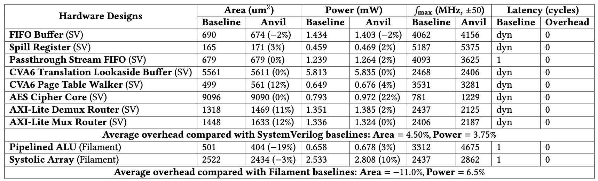

# Synthesis Reports

This directory contains synthesis reports for hardware designs targeting commercial 22nm ASIC technology. The reports compare two design implementations: **Anvil** and **Baseline** (filament for Pipelined Designs(SA and ALU), SystemVerilog otherwise), across multiple hardware modules.

## Overview

The synthesis analysis evaluates two key metrics:

- **Maximum Frequency (fmax)**: The highest clock frequency each design can achieve while meeting timing constraints
- **Area and Power**: Resource utilization measured at a normalized frequency of min(fmax(anvil), fmax(baseline))/2

## Directory Structure

### 1. Area and Power Reports (`area_power_results/`)

Contains synthesis reports showing area and power consumption for each hardware module at the normalized operating frequency.

```
area_power_results/
├── AES_Cipher_Core/
│   ├── anvil.rep
│   └── baseline.rep
├── AXI_Lite_Demux_Router/
│   ├── anvil.rep
│   └── baseline.rep
├── AXI_Lite_Mux_Router/
│   ├── anvil.rep
│   └── baseline.rep
├── CVA6_Page_Table_Walker/
│   ├── anvil.rep
│   └── baseline.rep
├── CVA6_Translation_Lookaside_Buffer/
│   ├── anvil.rep
│   └── baseline.rep
├── Fifo_Buffer/
│   ├── anvil.rep
│   └── baseline.rep
├── Passthrough_Stream_Fifo/
│   ├── anvil.rep
│   └── baseline.rep
├── Pipelined_ALU/
│   ├── anvil.rep
│   └── baseline.rep
├── Spill_Register/
│   ├── anvil.rep
│   └── baseline.rep
└── Systolic_Array/
    ├── anvil.rep
    └── baseline.rep
```

### 2. Maximum Frequency Reports (`fmax_results/`)

Contains timing analysis reports for each design variant. Each module includes:

- **`fmax_*.rep`**: Highest frequency at which timing constraints are met
- **`failed_freq_*.rep`**: Lowest frequency at which timing constraints fail

```
fmax_results/
├── AES_Cipher_Core/
│   ├── result_aes_opentitan_core/
│   │   ├── failed_freq_825.rep
│   │   └── fmax_781.rep
│   └── result_anvil_aes_core/
│       ├── failed_freq_1256.rep
│       └── fmax_1229.rep
├── AXI_Lite_Demux/
│   ├── result_axi_anvil_demux/
│   │   ├── failed_freq_2156.rep
│   │   └── fmax_2125.rep
│   └── result_axi_lite_demux/
│       ├── failed_freq_2468.rep
│       └── fmax_2437.rep
├── AXI_Lite_Mux/
│   ├── result_anvil_axi_lite_mux/
│   │   ├── failed_freq_2218.rep
│   │   └── fmax_2187.rep
│   └── result_axi_lite_mux/
│       ├── failed_freq_2437.rep
│       └── fmax_2406.rep
├── CVA6_PTW/
│   ├── result_anvil_ptw/
│   │   ├── failed_freq_3312.rep
│   │   └── fmax_3281.rep
│   └── result_cva6_default_ptw/
│       ├── failed_freq_3562.rep
│       └── fmax_3531.rep
├── CVA6_TLB/
│   ├── result_anvil_tlb/
│   │   ├── failed_freq_2437.rep
│   │   └── fmax_2406.rep
│   └── result_default_tlb/
│       ├── failed_freq_2500.rep
│       └── fmax_2468.rep
├── FIFO/
│   ├── result_anvil_fifo/
│   │   ├── failed_freq_4203.rep
│   │   └── fmax_4156.rep
│   └── result_fifo_v3/
│       ├── failed_freq_4109.rep
│       └── fmax_4062.rep
├── PIPELINED_ALU/
│   ├── result_anvil_alu/
│   │   ├── failed_freq_5175.rep
│   │   └── fmax_4675.rep
│   └── result_filament_alu/
│       ├── failed_freq_3343.rep
│       └── fmax_3312.rep
├── Pipelined_Systolic_Array/
│   ├── result_anvil_sa/
│   │   ├── failed_freq_2962.rep
│   │   └── fmax_2862.rep
│   └── result_filament_sa/
│       ├── failed_freq_2468.rep
│       └── fmax_2437.rep
├── Spill_Register/
│   ├── result_anvil_spill_reg/
│   │   ├── failed_freq_5421.rep
│   │   └── fmax_5375.rep
│   └── result_spill_register/
│       ├── failed_freq_5234.rep
│       └── fmax_5187.rep
└── Stream_FIFO/
    ├── result_anvil_stream_fifo/
    │   ├── failed_freq_3656.rep
    │   └── fmax_3625.rep
    └── result_stream_fifo/
        ├── failed_freq_4125.rep
        └── fmax_4093.rep
```


## Summary


